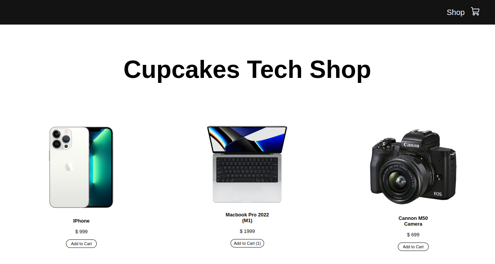

<h1 align="center">React Shopping Cart Ecommerce Beginner Website</h1>

In the project directory, you can run:

<i>npm start</i>

    The Class is here:
    <a href="https://www.youtube.com/watch?v=tEMrD9t85v4">
        React Shopping Cart Ecommerce Beginner Website - Build & Deploy A React Beginner Project (PedroTech)
    </a>

  

  
  

